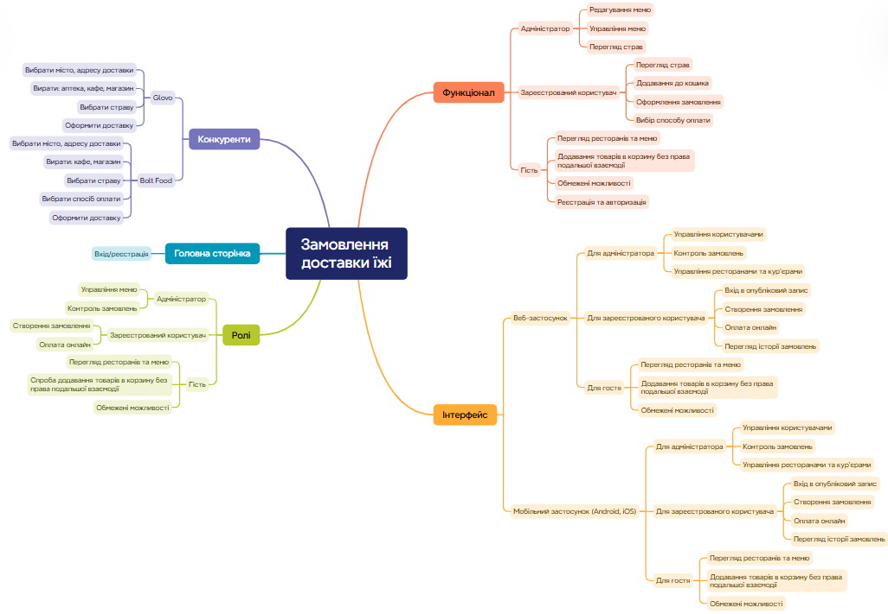
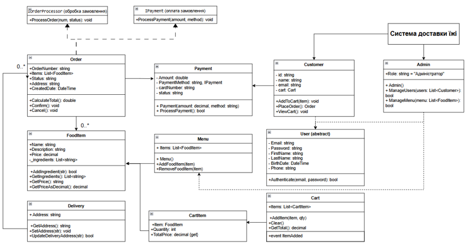

# OOP_Project
# Система замовлення доставки їжі – Glovo (Курсовий проєкт, Варіант №8)

## Опис проєкту

Цей проєкт є реалізацією десктопної інформаційної системи для онлайн-замовлення доставки їжі, натхненний сервісом **Glovo**. Програма дозволяє клієнтам переглядати меню, оформлювати замовлення, додавати страви до кошика, а адміністраторам – редагувати список страв.

## Мета

Створити автоматизовану програму, яка покращує взаємодію між користувачем і рестораном, забезпечуючи:
- інтуїтивно зрозумілий інтерфейс;
- зручний процес замовлення;
- облік замовлень;
- розширювану структуру для адміністрування меню.

## Потенційні користувачі

- Клієнти, які замовляють їжу онлайн.
- Адміністратори ресторану (менеджери).
- Кур'єри (у подальшій розробці).
- Розробники (як демонстраційний приклад).

---

## Функціонал

### Для клієнтів:
- Перегляд меню;
- Вибір страви та кількості;
- Додавання до кошика;
- Перехід до перегляду кошика.

### Для адміністратора:
- Перегляд та редагування меню;
- Додавання нових страв;
- Видалення страв;
- Повернення до головного вікна.

---

## Технології

| Компонент | Технологія |
|----------|------------|
| Мова | C# |
| Фреймворк | .NET 6.0 / WPF |
| Парадигми | ООП (SOLID), Делегати, Події |
| Колекції | `List<T>`, `ObservableCollection<T>` |
| Обробка | LINQ |
| Збереження | Серіалізація/Десеріалізація (JSON) |

---

## Аналоги

| Назва       | Посилання                              |
|-------------|----------------------------------------|
| **Glovo**   | [glovoapp.com](https://glovoapp.com)   |
| **Uber Eats** | [ubereats.com](https://www.ubereats.com) |
| **Bolt Food** | [bolt.eu/food](https://bolt.eu/uk-ua/food/) |

---

## Структура проєкту

## Побудова Mind Map для заданої предметної області

На рисунку 1 наведено побудовану Mind Map для заданої предметної області – Замовлення доставки їжі.  
  
Рисунок 1 – Mind map для Замовлення доставки їжі 

## Загальна діаграма класів

На рисунку 2 наведено загальну діаграму класів, яка була побудована з використанням сервісу draw.io.  
  
Рисунок 2 – Загальна діаграма класів Програми Замовлення доставки їжі

## Розроблення unit-тестів для класів предметної області

На рисунку 3 наведено файлову структуру тестового проєкту.  
  
Рисунок 3 – Структура тестового проєкту

## Структура проєкту з реалізацією класів інтерфейсу користувача

На рисунку 4 наведено файлову структуру проєкту.  
  
Рисунок 4 – Структура проєкту з інтерфейсом користувача
